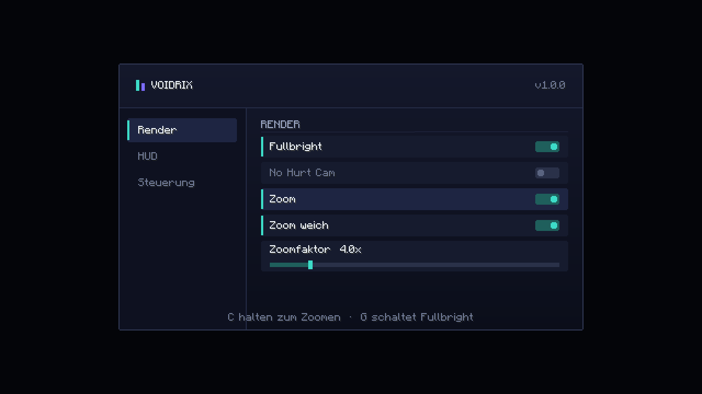
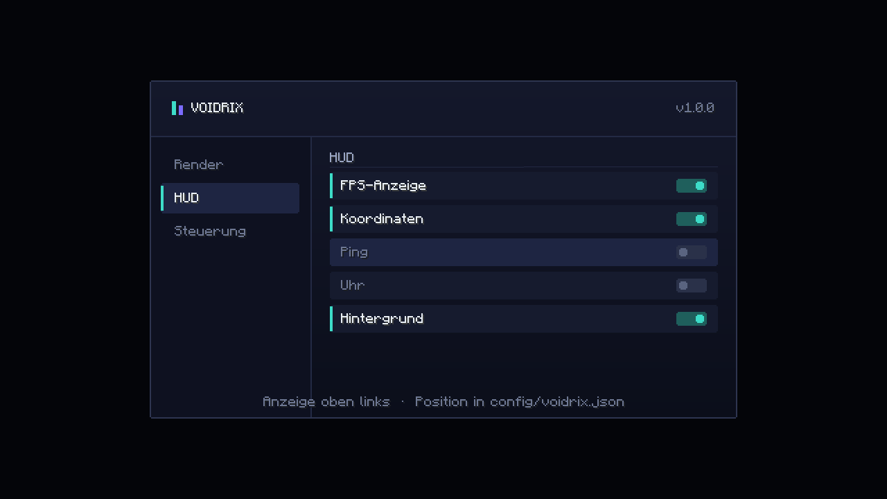
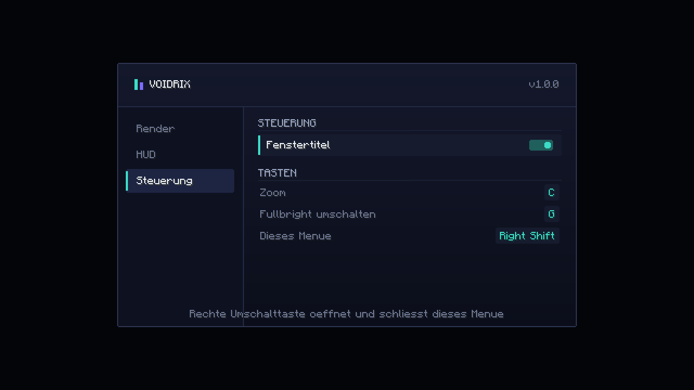

# Voidrix Client

Clientseitiger Fabric-Mod für **Minecraft 26.2**.

Das Repo enthält zwei getrennte Dinge — bitte nicht verwechseln:

| Verzeichnis | Was | Baubar? |
|---|---|---|
| `src/` | Der **lauffähige Voidrix-Mod**. Eigener Code, baut zu einem installierbaren JAR. | ✅ ja |
| `reference/` | Der **entpackte, auf Voidrix umbenannte** Inhalt der hochgeladenen `client.zip` — dekompilierte Quellen als API-Referenz. | ❌ nein (siehe unten) |

## Bauen

Voraussetzung: **JDK 25** (Minecraft 26.2 verlangt das, Gradle selbst muss darauf laufen).

```bash
JAVA_HOME=/pfad/zu/jdk25 ./gradlew build
```

Ergebnis: `build/libs/voidrix-client-1.0.0.jar`

## Installieren

1. Fabric Loader ≥ 0.19.0 für Minecraft 26.2 installieren
2. [Fabric API](https://modrinth.com/mod/fabric-api) (`0.156.0+26.2`) in den `mods/`-Ordner
3. `voidrix-client-1.0.0.jar` dazulegen

## Menü







Aufnahmen aus dem laufenden Client (Minecraft 26.2, GUI-Skalierung 2).

## Funktionen

| Feature | Standardtaste | Beschreibung |
|---|---|---|
| Zoom | `C` (halten) | Sichtfeld-Zoom, Faktor einstellbar, optional weich |
| Fullbright | `G` | Volle Helligkeit ohne Gamma-Regler |
| No Hurt Cam | – | Unterdrückt das Kamera-Wackeln bei Schaden |
| HUD | – | FPS, Koordinaten, Ping, Uhr — mit optionalem Hintergrund |
| Fenstertitel | – | Branding im Fenstertitel |
| Einstellungsmenü | `Rechts-Umschalt` | Alle Optionen umschaltbar |

Einstellungen liegen als JSON in `config/voidrix.json` und werden beim Schließen des Menüs gespeichert.

## Aufbau

```
src/main/java/gg/voidrix/client/
├── Voidrix.java              # Einstiegspunkt: Config laden, Keybinds, Tick-Handler
├── VoidrixConfig.java        # Gson-Konfiguration mit Wertkorrektur beim Laden
├── feature/                  # Logik — Zoom, HudOverlay
├── mixin/                    # Nur Einhängepunkte, keine Logik
└── screen/                   # Einstellungsmenü, Toggle-Widget, Farbschema
```

Die Mixins enthalten bewusst keine Logik: sie lesen die Konfiguration und rufen `feature/` auf.
Dadurch bleibt jeder Injection Point klein und beim nächsten Minecraft-Update leicht nachzuziehen.

Die fünf Injection Points sind gegen das echte 26.2-Bytecode verifiziert:

| Mixin | Ziel |
|---|---|
| `CameraZoomMixin` | `Camera.calculateFov(float)`, `Camera.calculateHudFov(float)` |
| `FullBrightMixin` | `LightmapRenderStateExtractor.extract` → `Double.floatValue()` (ordinal 0) |
| `HudOverlayMixin` | `Hud.extractRenderState(GuiGraphicsExtractor, DeltaTracker)` |
| `NoHurtCamMixin` | `GameRenderer.bobHurt(CameraRenderState, PoseStack)` |
| `WindowTitleMixin` | `Window.setTitle` → `GLFW.glfwSetWindowTitle(J, CharSequence)` |

## Besonderheiten von Minecraft 26.2

Wer den Build anfasst, stolpert sonst über diese vier Punkte:

* **Unobfuskiert.** Es gibt keine Mappings. `fabric.loom.disableObfuscation=true` in `gradle.properties`
  und `loom { noIntermediateMappings() }` sind Pflicht; `officialMojangMappings()` wird abgelehnt.
* **`modImplementation` existiert nicht** — ohne Remapping gibt es keine Mod-Konfigurationen, also
  ganz normal `implementation` verwenden.
* **JDK 25**, nicht 21. Gradle selbst muss darauf laufen, ein Toolchain-Eintrag allein reicht nicht.
* **HUD und Screens rendern über `GuiGraphicsExtractor`**, nicht `GuiGraphics`. Der aktuelle Screen
  liegt auf `Minecraft.gui.screen()` / `setScreen()`, nicht mehr direkt auf `Minecraft`.
  Keybinds kommen aus `fabric-key-mapping-api-v1` (`KeyMappingHelper.registerKeyMapping`).

## Warum `reference/` nicht baubar ist

Die hochgeladene `client.zip` enthält **keinen** kompilierbaren Mod:

1. **Kein Bytecode** — 0 `.class`-Dateien. Ein Repack ist damit ausgeschlossen.
2. **Vier fehlende Abhängigkeitsmodule.** Der Code importiert `gg.voidrix.compat.*`, `gg.voidrix.ui.*`,
   `gg.voidrix.cosmetics.*` und die geshadete owo-lib — mehrere hundert Klassen, die nicht mitgeliefert
   wurden. Von 564 Quelldateien haben nur 189 überhaupt keine fehlende Abhängigkeit, und das sind
   fast ausschließlich Enums und kleine Datenhalter.
3. **Dekompilat, kein Quellcode.** 44 Dateien enthalten Artefakte wie `/* $VF was: constructor-impl */`,
   dazu `@SourceDebugExtension`-Annotationen und synthetische Lambda-Klassen.

Der Baum ist trotzdem wertvoll: er dokumentiert die echte 26.2-API und hat als Vorlage für die
Mixin-Ziele oben gedient.

## Rebrand

Der gesamte Baum wurde von NoRisk/nrc auf Voidrix umbenannt — Pakete (`gg.norisk` → `gg.voidrix`),
Mod-ID (`nrcclient` → `voidrix`), Asset-Namespace (`noriskclient` → `voidrix`), Mixin-Präfix
(`nrc$` → `voidrix$`), Refmap, Access Widener, Klassennamen (`Nrc*`/`NoRisk*` → `Voidrix*`) und
Logger-Namen.

**Bewusst nicht umbenannt** wurden externe Kontrakte, weil Umbenennen dort nichts rebrandet, sondern
nur etwas kaputt macht:

`analytics-api-staging.norisk.gg` · `norisk.host` · `advert.norisk.space` (echte Server-IP) ·
`§f§lNoRisk§b§l.Host` (Anzeigename) · `dev.jakub.nrc.analytics` (Fremdbibliothek) ·
`nrc-analytics-client-*.jar` · `noriskclient-cosmetics` und `nrc-cosmetics` (fremde Pack-Namespaces)

Umbenannt wurden dagegen die System-Properties `voidrix.meta.dir`, `voidrix.profile.name` und
`voidrix.analytics.*` — **wer den Launcher betreibt, muss diese Namen dort mitziehen.**

## Lizenz

`fabric.mod.json` in `reference/` deklariert `ARR` und das Manifest verweist auf
`github.com/NoRiskClient/clientside-mirror`. Der Referenzbaum ist fremder, proprietärer Code —
bei einem öffentlichen Repo solltest du das prüfen. Der Code unter `src/` ist davon unabhängig
und neu geschrieben.

Weiterführend: [`docs/ARCHITECTURE.md`](docs/ARCHITECTURE.md) analysiert den Referenzbaum im Detail.
