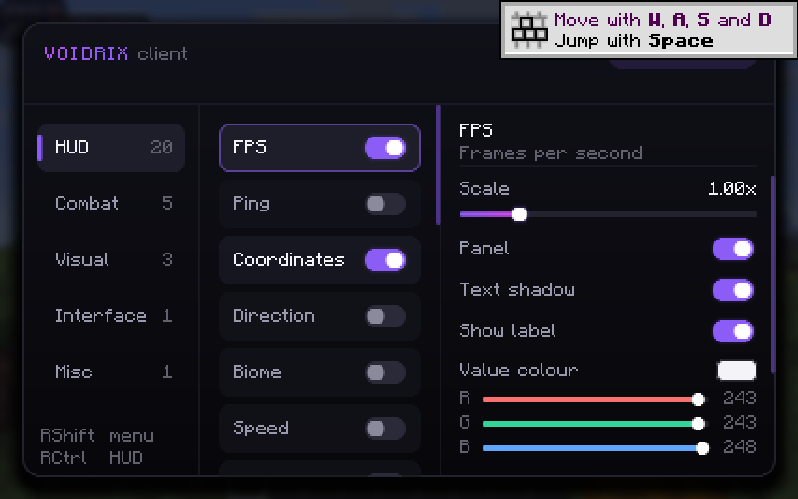
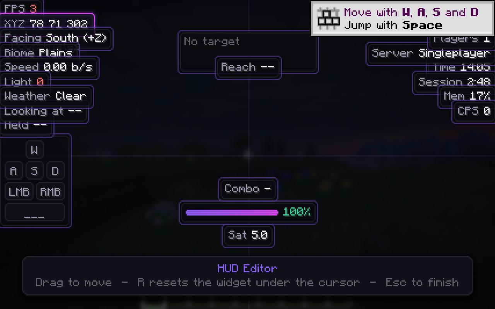
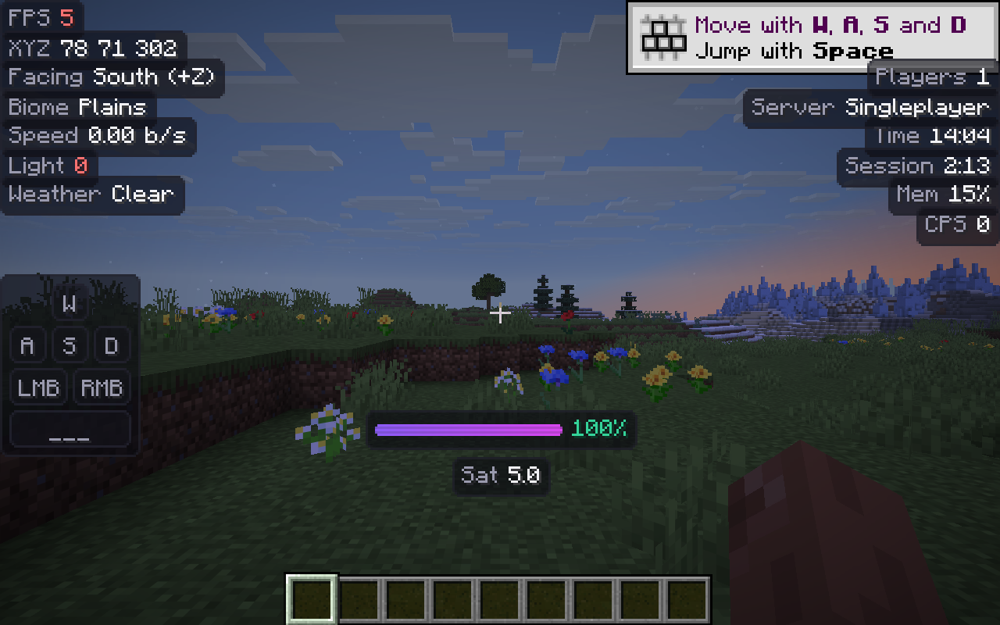
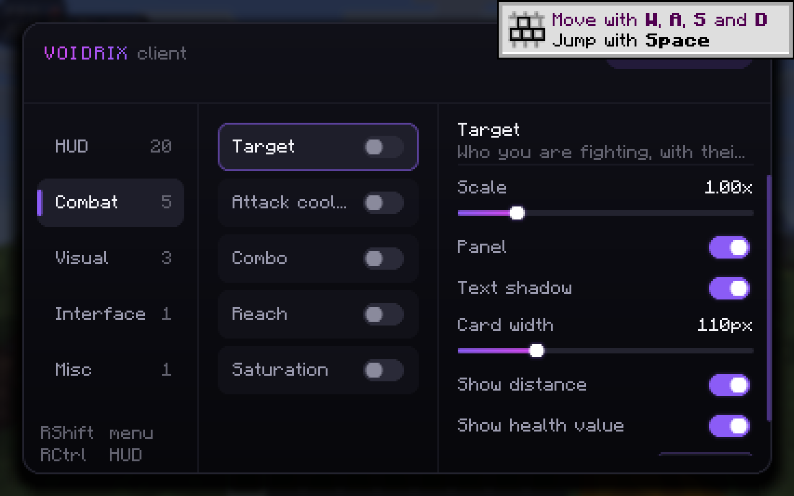
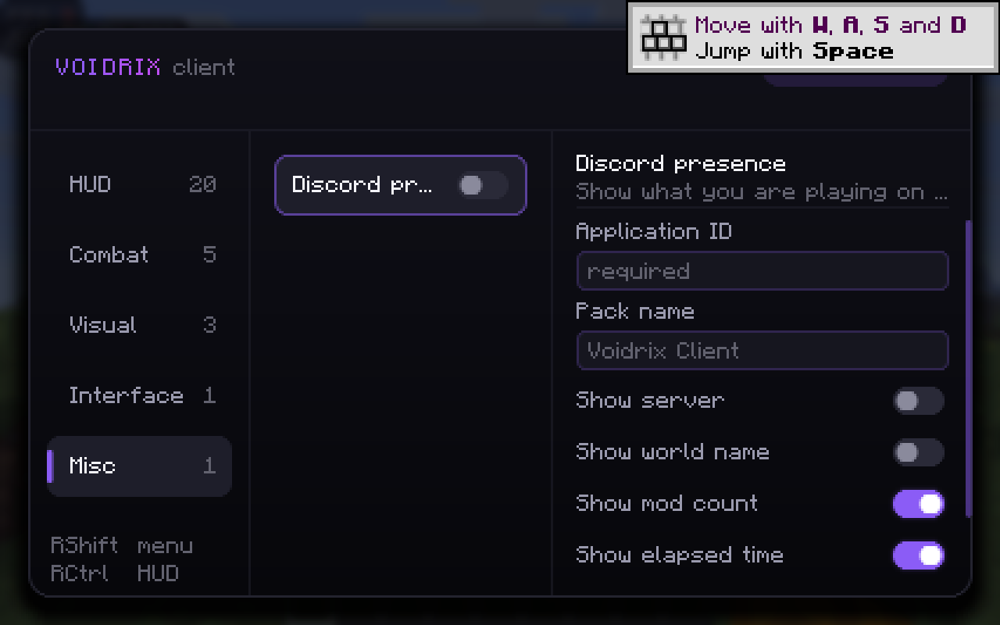

# Voidrix Client

A client-side quality-of-life mod for **Minecraft 26.2** on **Fabric**.

Voidrix gives you a movable HUD, combat readouts, visual tweaks, and control over which parts of the
vanilla interface you actually want to see — behind one dark, purpose-built menu.



---

## Where your data goes

Everything Voidrix does is local. Settings live in one JSON file on your disk. There is no account,
no login, no backend and no telemetry.

**One exception, and it is opt-in: Discord rich presence.** That feature exists to be seen by other
people, so when you switch it on it tells Discord what you are playing. It is off by default, needs
your own Discord application ID before it will do anything at all, and every piece of information it
can reveal — the server you are on, its address, your world name — is behind its own toggle, all of
them off to begin with. Nothing else in the mod opens a network connection.

---

## What it does

### The menu — `Right Shift`

Three columns: categories, the modules in that category, and the settings of whichever module you
selected. Toggles, sliders, dropdowns, RGB colour pickers and text fields, all drawn in the Voidrix
style.

Every module can be given its own toggle key from its settings panel — click the key button, press a
key, done. `Escape` while binding clears the key instead of assigning it.

### The HUD editor — `Right Ctrl`



Drag any widget anywhere. Widgets snap to the screen edges, the centre lines, and to each other's
edges once you get within a few pixels, with a guide line showing which snap took hold. `R` resets
the widget under the cursor. Widgets that are hiding because they have nothing to say are still
drawn here, so you can place them before you need them.

Positions are stored as a fraction of the free space on each axis, so a widget you push flush into a
corner stays in that corner at any window size, resolution or GUI scale — and one you leave centred
stays centred.

---

## Modules

30 in total, across five categories.

### HUD — 20 widgets



| Widget | Shows |
| --- | --- |
| FPS | Frame rate, optionally tinted green/amber/red by how healthy it is |
| Ping | Latency to the server, with the same colour grading |
| Coordinates | X/Y/Z, whole blocks or one decimal |
| Direction | Compass facing plus the axis it runs along |
| Biome | Biome at your feet, pretty-printed or as a raw id |
| Speed | Movement speed in blocks/second or km/h, measured from real position change |
| Clock | Your computer's clock, 12 or 24 hour |
| Session | Time since you launched the game |
| Memory | Heap usage as a percentage, megabytes, or both |
| CPS | Clicks per second, sampled per frame so fast clicks are not missed |
| Keystrokes | WASD, mouse buttons and jump, each fading as it is pressed |
| Armour | Equipped armour and held item with durability |
| Effects | Active potion effects, soonest to expire first |
| Durability | Remaining uses on your held item |
| Held item | What you are holding and how many you own in total |
| Looking at | The block or entity under your crosshair |
| Light level | Block light where you stand, with a spawnable warning |
| Weather | Clear, rain or thunder |
| Server | Address of the server you are on |
| Players | How many players are online |

### Combat — 5 widgets



**These are readouts, not advantages.** Every one of them shows information your client already has
and already draws somewhere — a nameplate, a fading crosshair, your own hunger. None of them sends
input, changes your reach, alters a hitbox or touches an entity. There is no auto-clicker, no aim
assist and no reach extension in Voidrix, and there will not be.

| Widget | Shows |
| --- | --- |
| Target | Who you are fighting: name, health bar that eases as they take damage, distance |
| Attack cooldown | How far your swing has recharged, as a bar and a percentage |
| Combo | Consecutive hits on the same target |
| Reach | How far away your last landed hit was |
| Saturation | Your own hidden food buffer, the one vanilla tracks but never draws |

### Visual — 3

- **Fullbright** — raise brightness past the vanilla ceiling. Your original value is captured on
  enable and put back on disable.
- **Zoom** — hold `C` to zoom, with an adjustable factor and optional easing.
- **No view bobbing** — stop the camera swaying as you walk.

### Interface — 1

- **Clean HUD** — hide the crosshair, hotbar, experience bar, health, hunger, armour bar, air
  bubbles, effect icons, scoreboard, boss bar or action bar text, individually and live.

### Misc — 1

- **Discord presence** — see below.

---

## Discord rich presence



Shows what you are playing on your Discord profile: a top line you choose (your modpack's name, for
instance), how many mods are loaded, whether you are in singleplayer or on a server, and a timer.

Voidrix speaks Discord's local IPC protocol directly rather than bundling a library, so there is no
third-party Discord code in the jar and nothing extra to keep up to date.

**Setting it up** needs a Discord application of your own, because rich presence is always attributed
to one:

1. Go to <https://discord.com/developers/applications> and create an application. Its name is what
   Discord shows as the game you are playing.
2. Copy the **Application ID** from the General Information page.
3. Under **Rich Presence → Art Assets**, upload an image with the key `voidrix` if you want an icon.
4. Paste the ID into the module's Application ID field in the Voidrix menu, then enable the module.

If Discord is not running, the module quietly waits and retries; it never blocks the game. All the
socket work happens on a background thread, and the game state it publishes is snapshotted on the
game thread, because reading Minecraft's world from another thread is not safe.

---

## Installing

1. Minecraft **26.2** with **Fabric Loader 0.19.0** or newer.
2. [Fabric API](https://modrinth.com/mod/fabric-api) — the only dependency.
3. Drop `voidrix-1.0.0.jar` into your `mods` folder.

Java 25 is required, because Minecraft 26.2 requires it.

---

## Building

```bash
./gradlew build
```

The jar lands in `build/libs/`. You need a **JDK 25** on `JAVA_HOME`; the Gradle wrapper pins
Gradle 9.5.1 and Fabric Loom 1.17.

Minecraft 26.2 ships deobfuscated, so there is no mappings step and no remapping — the build depends
on Minecraft and Fabric API directly.

To run a development client: `./gradlew runClient`.

---

## Your settings

Everything is written to:

```
.minecraft/config/voidrix/config.json
```

Readable and safe to hand-edit. The file is written to a temporary file and moved into place, so a
crash mid-save cannot truncate a config that was previously fine, and any single value that fails to
parse falls back to its default rather than resetting the rest.

---

## How it is put together

- **No mixins.** Voidrix touches nothing in Minecraft's internals. HUD widgets are registered as a
  single Fabric HUD element, and hiding vanilla elements works by wrapping them through Fabric's own
  registry rather than cancelling their draw calls. That keeps it compatible with other mods and
  means a Minecraft update is far less likely to break it.
- **One dependency.** Fabric API, nothing else — no Kotlin runtime, no UI library, no Discord
  library.
- **A widget that throws is switched off, not fatal.** A crash inside a widget's render would
  normally take the whole HUD, and the game, with it; instead it is logged and that widget is
  disabled.

Source layout:

```
dev.voidrix
├── VoidrixClient      entry point, module registry, tick and lifecycle wiring
├── VoidrixKeys        the three rebindable key bindings
├── config             the single local JSON config
├── discord            the Discord IPC client
├── module             module base classes and the modules themselves
├── setting            typed settings: bool, int, double, enum, colour, string
├── ui                 theme, drawing primitives, menu, HUD editor
└── util               keyboard polling, combat observation
```

The interface is drawn from scratch on top of Minecraft's `fill` and `text` calls. Rounded corners,
rings, shadows and glows are all built in `Draw` by emitting one horizontal span per pixel row and
feathering the end pixels — which is why the curves are smooth despite there being no rounded-rect
primitive to call. That geometry is written against a small `Canvas` interface rather than
Minecraft's graphics object, so the same code can be pointed at an image buffer and checked outside
the game.

---

## Licence

MIT. See [LICENSE](LICENSE).

Voidrix is original work. It is not affiliated with, derived from, or endorsed by any other
Minecraft client.
