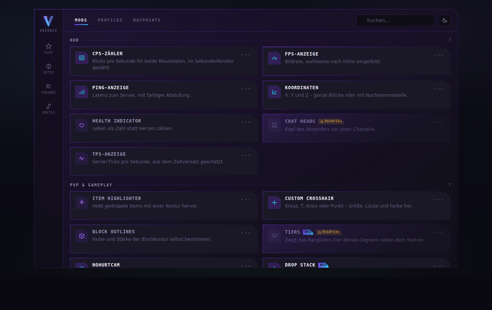

# Menu design prototype

`menu-prototype.html` is a self-contained, interactive mock of the redesigned Voidrix menu. Open it
in any browser — no build step, no dependencies, no network.

It exists to settle the visual language before it is rewritten in Java against Minecraft's drawing
calls. Iterating on a colour ramp or a corner treatment takes seconds here and a full client
relaunch in the mod.

## What it covers

- **Rail** — Voidrix+, Cosmetics, Friends, Emotes
- **Tabs** — Mods, Profiles, Waypoints, with a live search and a light/dark toggle
- **Card grid** — two columns, icon, title, two-line description, `NEU` badge, lock badge
- **Detail page** — back arrow, ON/OFF, reset, and one of every control type: slider paired with a
  number field, dropdown, colour picker, placeholder text field, toggle
- **Voidrix+** — code redemption, which unlocks the locked cards and switches the name prefix to
  its premium variant
- **Nametag preview** — the `V` prefix as it would appear above the head, in the tab list and in chat

## Design decisions worth carrying over

**The cut corner.** Every card and the panel itself lose their top-right corner. `clip-path` removes
borders, so the glowing hairline is a gradient layer with the content clipped one pixel inside it —
that way the contour follows the cut instead of squaring off at it.

**Glow instead of shadow.** Depth comes from `drop-shadow` in the accent hue, which follows the
clip path. Drop shadows under a faceted shape read as a mistake.

**Two type roles.** A monospace stack, uppercase and letter-spaced, for anything structural — labels,
titles, values. A system grotesk for prose. No webfont is linked, because the artifact CSP blocks
font CDNs and a silent fallback would quietly undo the whole look.

**The premium mark belongs to the wearer.** The `V` takes its premium styling from a class on the
mark itself, not from an ancestor. Inheriting it would hand the premium `V` to every friend in your
list the moment *you* unlocked Voidrix+.

## Two things this mock cannot honestly promise

**The code check is client-side.** `kwhfiejyguso+` is compared in JavaScript, which is fine for a
mock and worthless as a real entitlement — anyone can read it out of the file or set the flag in the
console. Real unlocking needs a server that issues and verifies, which the mod deliberately does not
have. Treat this as the visual half of the flow.

**The name prefix needs other players to be told.** Drawing a `V` in front of your own name is
local, but for it to appear on *your* name on someone else's screen, their client has to learn that
you use Voidrix. That means a shared server, which is exactly the piece the mod does not have today.
The preview shows what it would look like, not something the current mod can do.
